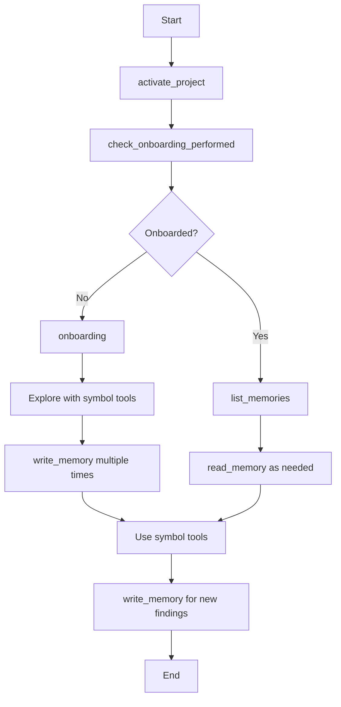

# Serena Setup Skill

## Purpose

This skill teaches the complete workflow for using Serena's MCP server effectively:
1. Project activation (starting LSP server)
2. Onboarding check and execution
3. Memory system usage (cross-session persistence)
4. Performance optimization (pre-indexing)

## When This Skill Activates

- ANY time you work with a codebase using Serena
- Start of new coding sessions
- When encountering "No active project" errors
- Before using symbol tools (get_symbols_overview, find_symbol, etc.)
- When performance is slow (first-time LSP parsing)

## Core Workflow: The Serena Activation Sequence

### Step 0: Verify Serena is Available

**Before anything else, check if Serena MCP server is configured:**

```python
# Try to use a Serena tool
try:
    activate_project(current_directory)
except ToolNotFound:
    # Serena not available
    inform_user("Serena MCP server not configured")
    provide_installation_instructions()
```

### Step 1: Activate Project (MANDATORY FIRST STEP)

**EVERY Serena session must start with project activation:**

```python
activate_project("/path/to/project")
# Or:
activate_project(current_directory)
```

**What this does:**
- Starts Language Server Protocol server for the project
- Loads project configuration from `.serena/project.yml`
- Initializes symbol cache
- Returns activation message with available memories

**Example Response:**
```
Project 'myapp' activated at /path/to/myapp.
Programming language: typescript
File encoding: utf-8
Available project memories: ['suggested_commands', 'code_style', 'architecture_overview']
Use the `read_memory` tool to read these memories later if they are relevant to the task.
```

**Common Error:**
```
Error: No active project. Please activate a project first.
```
→ Solution: Call `activate_project()` before using symbol tools

### Step 2: Check Onboarding Status

**Immediately after activation, check if project has been explored:**

```python
check_onboarding_performed()
```

**Responses:**

**A. Not Onboarded:**
```
Onboarding not performed yet (no memories available).
You should perform onboarding by calling the `onboarding` tool before proceeding with the task.
```

**B. Already Onboarded:**
```
The onboarding was already performed, below is the list of available memories.
Do not read them immediately, just remember that they exist and that you can read them later, if necessary.

['suggested_commands', 'code_style', 'architecture_overview', 'testing_guide']
```

### Step 3a: Perform Onboarding (If Needed)

**If onboarding not performed, call the onboarding tool:**

```python
onboarding()
```

**This returns a detailed prompt instructing you to:**

1. **Gather Project Information:**
   - Project's purpose
   - Tech stack used
   - Code style and conventions (naming, type hints, docstrings, etc.)
   - Testing/formatting/linting commands
   - Codebase structure
   - Entry point commands (how to run the project)
   - Guidelines, patterns, standards

2. **Use Symbol Tools to Explore:**
   - `get_symbols_overview` for file structure
   - `find_symbol` for locating code entities
   - `find_referencing_symbols` for understanding relationships
   - Read only necessary files (avoid loading too much into memory)

3. **Persist Findings with `write_memory()`:**
   - `suggested_commands.md` - Test/lint/run commands
   - `code_style.md` - Naming conventions, patterns
   - `task_completion_checklist.md` - What to do when done
   - `architecture_overview.md` - System structure
   - Custom memories as needed

**Example Onboarding Flow:**
```python
# 1. Get onboarding instructions
instructions = onboarding()

# 2. Explore codebase
structure = list_dir(".", recursive=True)
package_info = read_file("package.json")  # Or requirements.txt, etc.
readme = read_file("README.md")

# 3. Use symbol tools
main_symbols = get_symbols_overview("src/main.ts")
components = find_symbol("", include_kinds=[5], relative_path="src/components/")

# 4. Persist findings
write_memory("suggested_commands", """
# Suggested Commands

## Testing
- Run: `npm test`
- Watch: `npm test -- --watch`

## Linting
- Check: `npm run lint`
- Fix: `npm run lint:fix`

## Development
- Start: `npm run dev`
- Build: `npm run build`
""")

write_memory("code_style", """
# Code Style

- TypeScript with strict mode
- React functional components with hooks
- Styled-components for styling
- ESLint + Prettier for formatting
- Test files: `__tests__/*.test.ts`
""")

write_memory("architecture_overview", """
# Architecture Overview

## Structure
- `/src/components` - React components
- `/src/services` - Business logic
- `/src/utils` - Utilities
- `/src/types` - TypeScript types

## Key Symbols
- App: src/App.tsx:10
- Router: src/routes/Router.tsx:15
- API client: src/services/api.ts:20
""")
```

### Step 3b: Load Existing Memories (If Already Onboarded)

**If onboarding already performed:**

```python
# 1. See what memories exist
available_memories = list_memories()
# Returns: ['suggested_commands', 'code_style', 'architecture_overview', ...]

# 2. Load relevant memories
commands_info = read_memory("suggested_commands")
style_guide = read_memory("code_style")
architecture = read_memory("architecture_overview")

# 3. Use this knowledge for current task
```

### Step 4: Use Symbol Tools

**Now you can use symbol tools (expect first-time slowness):**

```python
# Overview of a file
overview = get_symbols_overview("src/auth/service.ts")
# First call may be slow (LSP parsing)

# Find specific symbols
auth_class = find_symbol("AuthService", depth=1)
# Subsequent calls faster (cache hit)

# Find references
usages = find_referencing_symbols("AuthService", relative_path="src/auth/service.ts")
```

**Performance Note:**
- First symbol tool calls trigger LSP parsing (slow)
- Results cached in `.serena/cache/document_symbols_cache_*.pkl`
- Subsequent calls use cache (instant)
- Recommend pre-indexing for large projects

### Step 5: Persist New Discoveries

**As you work, persist new findings:**

```python
# After analyzing authentication system
write_memory("auth-system", """
# Authentication System

## Flow
User → Login → JWT Token → Middleware → Protected Routes

## Key Symbols
- AuthService: src/auth/service.ts:15
  - login: Line 42
  - verifyToken: Line 78
  - refreshSession: Line 92

## Dependencies
- LoginController uses AuthService (12 calls)
- APIGateway uses AuthService (8 calls)
- Protected routes use AuthMiddleware

## Implementation Notes
- Uses JWT with 15-minute expiration
- Refresh tokens stored in Redis
- Middleware checks token on every request
""")
```

## Performance Optimization: Pre-Indexing

### Problem

First-time symbol tool calls are slow because the LSP must parse files.

**Example:**
```python
get_symbols_overview("src/")  # First call: 30+ seconds
find_symbol("AuthService")     # LSP parsing all files
```

### Solution: Pre-Index the Project

**Recommend to user (they run this in terminal):**

```bash
# From project root
uvx --from git+https://github.com/oraios/serena serena project index
```

**What this does:**
- Parses all source files
- Builds symbol cache
- Saves to `.serena/cache/document_symbols_cache_*.pkl`
- Subsequent symbol calls are instant

**When to recommend:**
- Large codebases (>100 files)
- First time working with a project
- When you notice slow symbol tool responses

### Verification

```python
# After pre-indexing, symbol tools are instant:
overview = get_symbols_overview("src/")  # Now: <1 second
symbols = find_symbol("", include_kinds=[5])  # Fast
```

## Complete Example Session

**User:** "Help me understand and extend the authentication system"

**Your Process:**

```python
# Step 0: Verify Serena available (implicitly, by trying to use it)

# Step 1: Activate project
result = activate_project(current_directory)
# → "Project 'myapp' activated. Available memories: ['suggested_commands', 'code_style']"

# Step 2: Check onboarding
onboarding_status = check_onboarding_performed()
# → "Onboarding already performed. Memories: ['suggested_commands', 'code_style', ...]"

# Step 3b: Load existing memories (already onboarded)
memories = list_memories()
# → ['suggested_commands', 'code_style', 'architecture_overview']

arch_info = read_memory("architecture_overview")
# → See that auth is in src/auth/

style_guide = read_memory("code_style")
# → TypeScript, uses classes, etc.

# Step 4: Use symbol tools (may recommend pre-indexing if slow)
auth_symbols = find_symbol("auth", substring_matching=True)
# If slow, note: "First symbol call may take a moment (LSP parsing)"
# Recommend: "For faster subsequent calls, run: serena project index"

auth_service = find_symbol("AuthService", depth=1)
# → See all methods: login, logout, verifyToken, refreshSession

verify_method = find_symbol("AuthService/verifyToken", include_body=True)
# → Read just this method

usages = find_referencing_symbols("AuthService", relative_path="src/auth/service.ts")
# → See what uses AuthService

# Step 5: Persist new findings
write_memory("auth-system", """
# Authentication System Analysis

## Current Implementation
[Findings from symbol exploration]

## Extension Plan for New Feature
[Plan based on understanding]

## Symbol Locations for Implementation
- AuthService/login - src/auth/service.ts:42
- AuthService/verifyToken - src/auth/service.ts:78
- To extend: Add AuthService/refreshToken method
""")

# Inform user
"Analysis complete. Findings saved to .serena/memories/auth-system.md"
"Ready to implement extension following existing patterns."
```

## Memory System Best Practices

### When to Write Memories

**Always write memories for:**
- Onboarding findings (required by onboarding() prompt)
- System/component analysis results
- Implementation decisions and rationale
- Discovered patterns and conventions
- Cross-session continuity (when running out of context)

**Example:**
```python
write_memory("payment-integration-decision", """
# Payment Integration Decision

## Research Conducted
- Compared Stripe, PayPal, Square
- See: .serena/memories/payment-research.md

## Decision
Use Stripe for:
- Better documentation
- Simpler API
- React components available

## Implementation Plan
1. Create PaymentService class (pattern: AuthService)
2. Add Stripe webhook handler
3. Tests in __tests__/payment.test.ts
""")
```

### When to Read Memories

**Read memories when:**
- Starting a new task in an onboarded project
- Need to understand conventions
- Planning implementation (check suggested_commands)
- Before making changes (check code_style)

**Example:**
```python
# Before implementing feature
commands = read_memory("suggested_commands")
# → Know how to test

style = read_memory("code_style")
# → Follow naming conventions

arch = read_memory("architecture_overview")
# → Understand where new code should go
```

### Memory Organization

**Standard Memories (from onboarding):**
- `suggested_commands.md` - How to test/lint/run
- `code_style.md` - Conventions and patterns
- `task_completion_checklist.md` - What to do when done
- `architecture_overview.md` - System structure

**Task-Specific Memories:**
- `[component]-system.md` - Component analysis
- `[feature]-implementation.md` - Implementation details
- `[research-topic].md` - Research findings

## Error Handling

### Common Errors and Solutions

**Error: "No active project"**
```
Solution: Call activate_project() first
```

**Error: "Tool not found: get_symbols_overview"**
```
Problem: Serena MCP server not configured
Solution: Install Serena (see README.md)
```

**Slow symbol tool responses**
```
Problem: LSP parsing files for first time
Solution: Recommend to user: `serena project index`
```

**Memory not found**
```
Problem: Memory doesn't exist or onboarding not performed
Solution: Check onboarding status, perform if needed
```

## Integration with Other Skills

### With symbol-navigator

serena-setup activates, THEN symbol-navigator teaches tool usage:

```
serena-setup: activate → onboard → memories loaded
symbol-navigator: Now teach symbol tool selection
```

### With code-structure-analyst

serena-setup handles activation, code-structure-analyst uses onboarding:

```
serena-setup: Ensure activated and onboarded
code-structure-analyst: Follow onboarding prompt for exploration
```

### With task-decomposer

Serena memories inform task decomposition:

```python
# Task decomposer reads memories to understand codebase
arch = read_memory("architecture_overview")
commands = read_memory("suggested_commands")
# Then decompose task based on this knowledge
```

## Checklist: Proper Serena Usage

Before using ANY symbol tools:
- [ ] `activate_project()` called
- [ ] `check_onboarding_performed()` called
- [ ] If not onboarded: `onboarding()` → follow prompt → `write_memory()` multiple times
- [ ] If onboarded: `list_memories()` → `read_memory()` as needed
- [ ] Expect first symbol calls to be slow
- [ ] Recommend pre-indexing for large projects

During work:
- [ ] Use `write_memory()` for new findings (NOT Write tool)
- [ ] Persist to `.serena/memories/` (NOT `.agent-notes/`)
- [ ] Document symbol locations for implementation team
- [ ] Update existing memories when new info discovered

## Summary

**The Complete Serena Workflow:**



**Remember:**
- Activation FIRST, always
- Onboarding creates foundation
- Memories provide continuity
- Pre-indexing speeds up LSP
- write_memory() persists knowledge

This is the foundation for all Serena-based work.
